# Práctica 2.1 Instalación y configuración de servidor web Nginx

## Instalación del servidor

Antes de instalar, actualizamos los repositorios `sudo apt update` y después instalamos el paquete `sudo apt install nginx`.

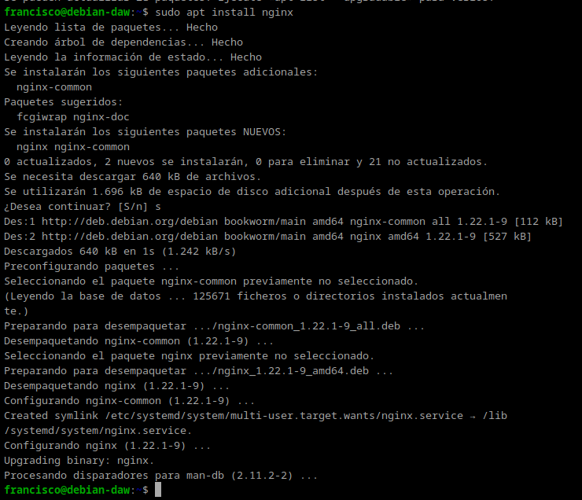

Comprobamos que se ha instaldo y que está funcionando correctamente con el comando `systemctl status nginx`.

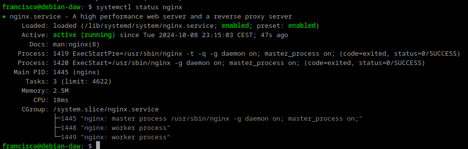

## Creación de las carpetas del sitio web

Creamos la carpeta de nuestro sitio web con el comando `sudo mkdir -p /var/www/practica2.1/html`.

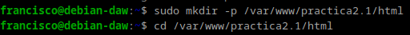

Dentro de esta carpeta, clonamos el siguiente repositorio de github:
~~~~
https://github.com/cloudacademy/static-website-example
~~~~

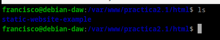

Hacemos al usuario `www-data` propietario de esta carpeta, con el comando
~~~~
sudo chown -R www-data:www-data /var/www/nombre_web/html
~~~~

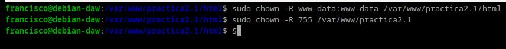

Desde nuestro equipo cliente accedemos a la ip del servidor `http://192.168.1.143` desde un navegador y debería de salir algo como esto: 

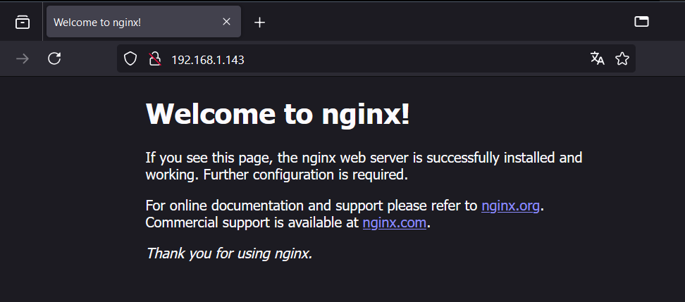

## Configuración de servidor web NGINX
Creamos un archivo de configuración que es la página que se muestra si accedemos al servidor sin indicar ningún sitio web.

~~~~
sudo nano /etc/nginx/sites-available/practica2.1
~~~~

En este archivo de configuración, hay que poner lo siguiente:

~~~~
server {
        listen 80;
        listen [::]:80;
        root /var/www/practica2.1/html/static-website-example;
        index index.html index.htm index.nginx-debian.html;
        server_name nombre_web;
        location / {
                try_files $uri $uri/ =404;
        }
}
~~~~

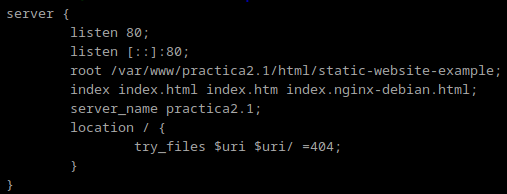

Creamos un archivo simbólico entre este archivo y el de sitios que 
están habilitados, para que se dé de alta automáticamente 
con `sudo ln -s /etc/nginx/sites-available/practica2.1 /etc/nginx/sites-enabled/`.

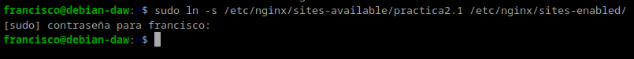

## Comprobaciones
En nuestra máquina anfitriona tenemos que editar el archivo `C:\Windows\System32\drivers\etc\hosts`. Y añadir:
~~~~
192.168.1.143 practica2.1
~~~~

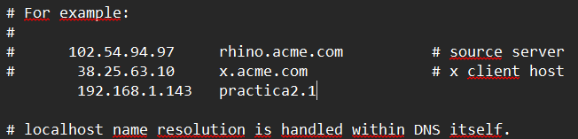

## FTP
FTP es un protocolo de transferencia de archivos entre sistemas
conectados a una red TCP. Actualmente, es un protocolo que poco a
poco va abandonándose, pero ha estado vigente más de 50 años.

## Configurar servidor SFTP en debian
Primero actualizamos los repositorios `sudo apt-get update`, después instalamos
el paquete.
~~~~
sudo apt-get install vsftpd
~~~~

Creamos una carpeta en el home de debian
~~~~
mkdir /home/francisco/ftp
~~~~

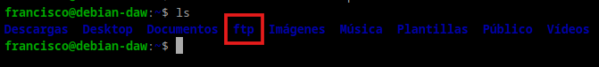

Creamos los certificados de seguridad necesarios para aportar la capa de cifrado a nuestra conexión
~~~~
sudo openssl req -x509 -nodes -days 365 -newkey rsa:2048 -keyout /etc/ssl/private/vsftpd.pem -out /etc/ssl/private/vsftpd.pem
~~~~

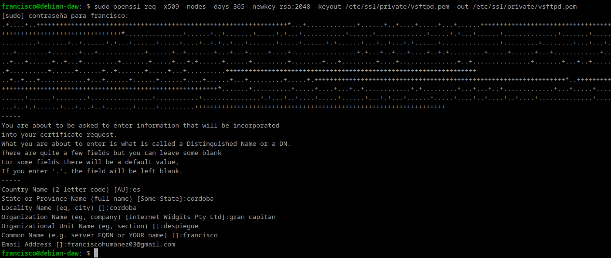

Editamos el archivo de configuración de este servicio `sudo nano /etc/vsftpd.conf`
~~~~
rsa_cert_file=/etc/ssl/private/vsftpd.pem
rsa_private_key_file=/etc/ssl/private/vsftpd.pem
ssl_enable=YES
allow_anon_ssl=NO
force_local_data_ssl=YES
force_local_logins_ssl=YES
ssl_tlsv1=YES
ssl_sslv2=NO
ssl_sslv3=NO
require_ssl_reuse=NO
ssl_ciphers=HIGH

local_root=/home/nombre_usuario/ftp
~~~~

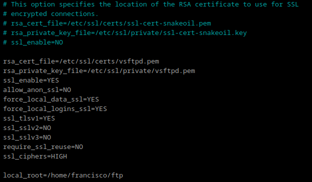

Reiniciamoss el servicio para cojer la nueva configuración `sudo systemctl restart --now vsftpd`.

Desde el equipo cliente, abrimos el programa filezilla y nos concetamos al servidor Debian. Y subimos un archivo a la carpeta `/home/francisco/ftp`.

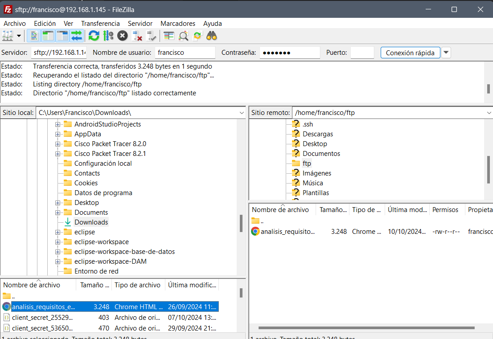

Desde el Debian ya podemos ver el archivo subido:

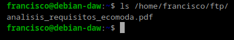

## HTTPS
En este apartado vamos a añadir a nuestro servidor una capa de seguridad necesaria. Haremos que todos nuestros sitios web alojados hagan uso de certificados SSL y se acceda a ellos por medio de HTTPS.

### Creación de certificado

Primero vamos a crear un directorio para almacenar los certificados `sudo mkdir /etc/ssl/certificados`.

Generamos la clave privada `sudo openssl genpkey -algorithm RSA -out /etc/ssl/certificados/clave_privada.key`.

Y por ultimo generamos un certificado autofirmado `sudo openssl req -new -x509 -key /etc/ssl/certificados/clave_privada.key -out /etc/ssl/certificados/certificado_autofirmado.crt -days 365`.

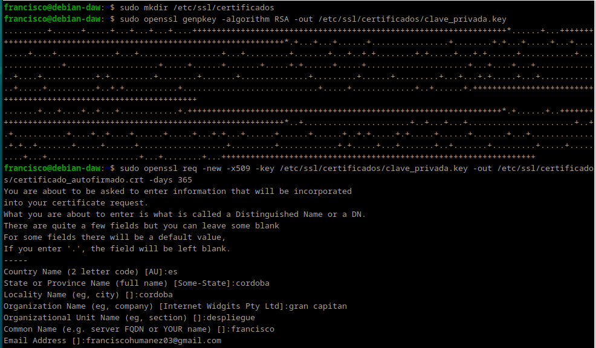

### Configuración de Nginx

Vamos a configurar el archivo de nginx `/etc/nginx/sites-available/default`.

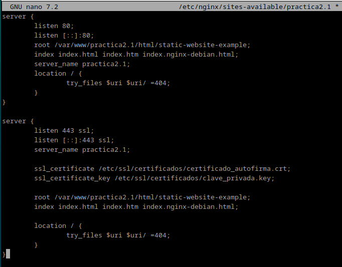

Reiniciamos Nginx `sudo systemctl restart nginx`.

