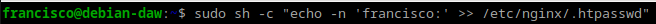
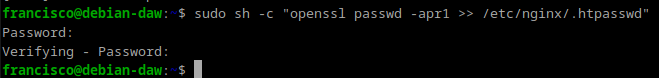
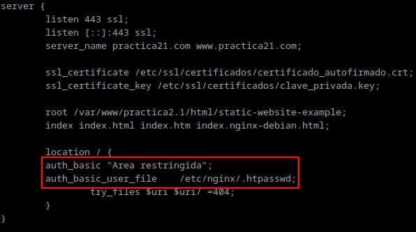
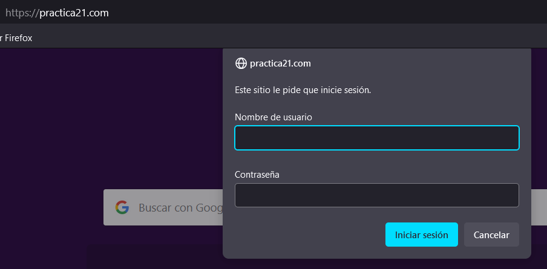
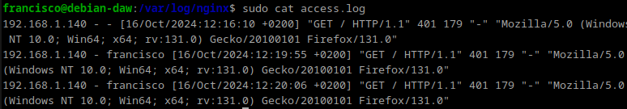
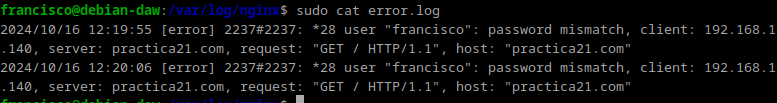
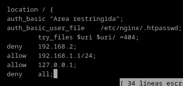

# Práctica 2.2 Autenticación en Nginx

## Paquetes necesarios
Para esta práctica podemos utilizar la herramienta openssl para crear las contraseñas.
En primer lugar debemos comporbar si el paquete esta instalado `dpkg -l | grep openssl`. Y si no, instalarlo.

## Creación de usuarios y contraseñas para el acceso web
Creamos un archivo oculto llamado `.htpasswd` en el directorio de configuración `/etc/nginx` donde guardar nuestros usuarios y contraseñas:
~~~
sudo sh -c "echo -n 'vuestro_nombre:' >> /etc/nginx/.htpasswd"
~~~

Creamos una contraseña para el usuario:
~~~
sudo sh -c "openssl passwd -apr1 >> /etc/nginx/.htpasswd"
~~~

## Configuración del servidor Nginx para usar autenticación
Editamos el archivo `/etc/nginx/sites-available/practica2.1`.
Añadimos estas dos líneas al archivo:
~~~
auth_basic "Area restringida";
auth_basic_user_file /etc/nginx/.htpasswd;
~~~

Reiniciamos el servicio para que se apliquen los cambios `sudo systemctl restart nginx`.

Comprobamos desde la máquina física que al acceder a `http://practica21.com` nos pide las credenciales

### Tarea 1
Adjunta una captura de pantalla de los logs donde se vea que intentas entrar primero con un usuario inválido y con otro válido. Indica dónde podemos ver los errores de usuario inválido o no encontrado, así como donde podemos ver el número de error que os aparecía antes
Archivo access.log

Archivo error.log

## Configuración de la autenticación básica con la restricción de acceso por IP

