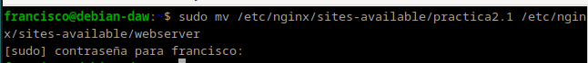
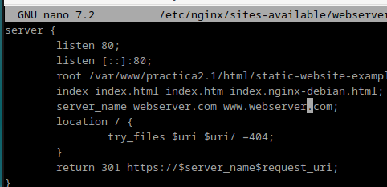
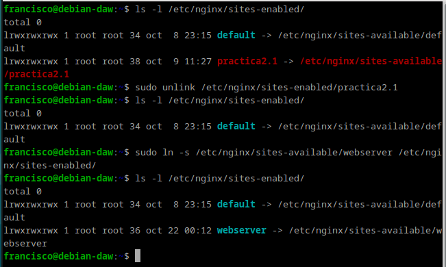
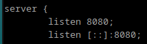
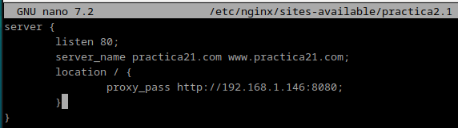
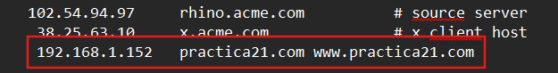
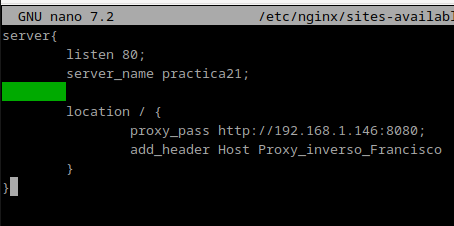
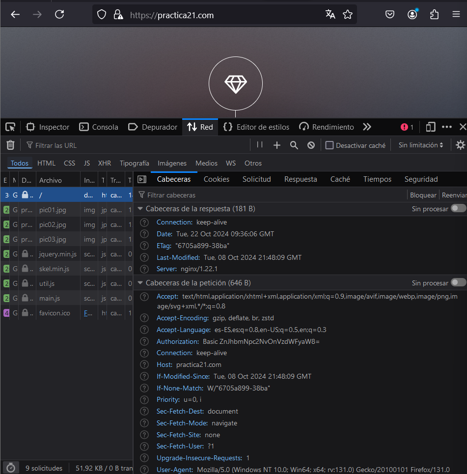

# Práctica 2.3 - Proxy inverso con Nginx

## ¿Qué es un servidor proxy?
Es un servidor que se encuentra frente a un grupo de máquinas cliente. Cuando esas máquinas realizan solicitudes a sitios y servicios en Internet, el servidor proxy intercepta esas solicitudes y luego se comunica con los servidores web en nombre de esos clientes, como un intermediario.

## Configuración
Vamos a configurrar dos debian con sendos servidores Nginx. Para eso la máquina que ya tenemos, la clonamos.
> [!WARNING]
> Cuidado
>
> Ojo al clonar la máquinass virtuales porque hay que darle a crear una nueva MAC, de lo contrario no tendréis IP en esa máquina.

1. En primer lugar, he cambiado el nombre que tenía la web por el de `webserver`, esto implica:
- Cambiar el nombre del archivo de configuración de sitios disponibles para Nginx

- Cambiar el nombre del sitio web dentro de este archivo de configuración deonde haga falta.

- Eliminar el link simólico antiguo con el comando `unlink practica21` dentro de la carpeta `sites-enabled` y crear uno nuevo para el nuevo nombre de archivo.

2. En el archivo de configuración del sitio web, en lugar de hacer que el servidor escuche en el puerto 80, lo he cambiado al 8080.

3. Reiniciar Nginx `sudo systemctl restart nginx`

## Nginx proxy inverso
Ahora, cuando intentamos acceder a `http://practica21.com`, en realidad estamos accediendo al proxy, que nos redirigirá a http://webserver:8080, el servidor web que acabamos de configurar para que escuche con ese nombre en el puerto 8080.
Para ello:
- Crear un archivo de configuración en sites-available con el nombre practica21.
- Este archivo de configuración será más simple, tendrá la siguiente forma

> [!WARNING]
> ¡Atención, muy importante!
>
> Hay que modificar el archivo host que configuramos en la práctica 2.1.

## Añadiendo cabeceras
Para añadir cabeceras, en el archivo de configuración del setio web debemos añadir dentro del bloque `location / { ... }` debemos añadir la directiva:
~~~
add_header Host Proxy_inverso_Francisco
~~~

Reiniciamos Nginx
