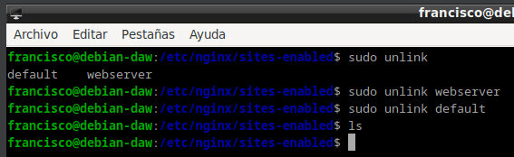
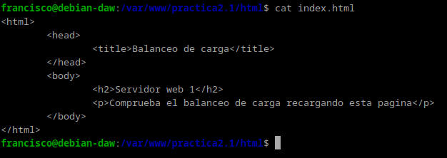
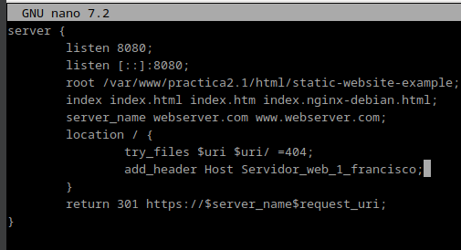
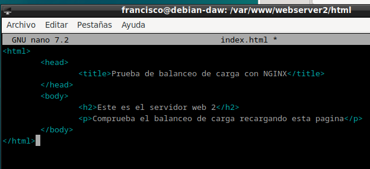
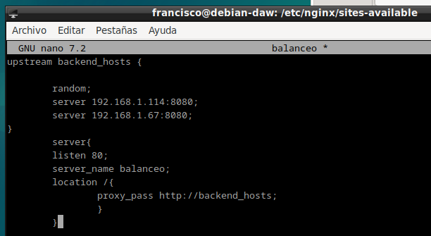

# Práctica 2.4 - Proxys inverso con balanceo de carga

Ya no vamos a utilizar los sitios web que hemos configurado en las prácticas anteriores. Por ello, para evitarnos una serie de problemas que pueden surgir, vamos a desactivarlos.

Dentro de la carpeta /etc/nginx/sites-enabled debemos ejecutar unlink nombre_archivo para cada uno de los archivos de los sitios web que tenemos.

## Nginx servidor web 1
Debemos configurar este servidor web para que sirva el siguiente index.html que debéis crear dentro de la carpeta /var/www/webserver1/html:

Debéis añadir una cabecera que se llame Serv_Web1_vuestronombre.

## Nginx servidor web 2
En este servidor web debemos realizar una configuración idéntica al servidor web 1 pero cambiando webserver1 por webserver2 (también en el index.html), así como el nombre de la cabecera añadida, que será Serv_Web2_vuestronombre.

## Nginx proxy inverso
Ya disponemos de los dos servidores web entre los que se van a repartir las peticiones que realice el cliente desde el navegador.

Vamos, por tanto, a configurar el proxy inverso para que realice este reparto de peticiones:

En sites-available debéis crear el archivo de configuración con el nombre balanceo.
