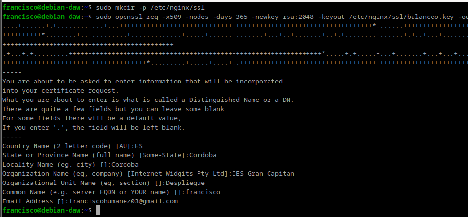
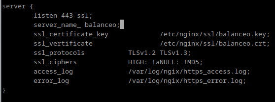
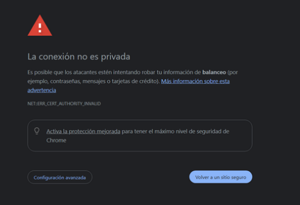

# Práctica 2.5 - Proxy inverso y balanceo de carga con SSL en NGINX

## Creación del certificado
En este caso no habrá peligro puesto que estamos 100% seguros que ese certificado lo hemos emitido nosotros para esta práctica, no hay dudas.

Veamos pues el proceso para generar los certificados y las claves asociadas a ellos (privada/pública). En primer lugar debemos crear el siguiente directorio `/etc/nginx/ssl`:

Vamos a crear el certificado y las claves de forma simultánea con un único comando: 

Os solicitará que introduzcáis una serie de parámetros, como véis en el recuadro rojo de abajo de la imagen. Debéis introducir los mismos parámetros que en la imagen excepto en el “Organizational Unit Name” que véis recuadrado en amarillo. Ahí deberéis poner `2DAW – DEAW - Vuestronombre`.

## Configuración SSL en el proxy inverso
De la práctica anterior, dentro del directorio `/etc/nginx/sites-available` ya debéis tener el archivo de configuración llamado balanceo. Es precisamente aquí donde realizaremos la configuración para que el acceso al sitio web se realice mediante SSL (HTTPS).

Dentro del bloque server {…} debéis cambiar el puerto de escucha (listen 80) por lo que véis en la imagen de abajo, añadiendo las siguientes líneas de configuración también, de tal forma que quede:

~~~
server {
    listen 443 ssl;
    ssl_certificate /etc/nginx/ssl/nginx.crt;
    ssl_certificate_key /etc/nginx/ssl/nginx.key;
    ssl_protocols TLSv1.2 TLSv1.3;
    ssl_ciphers HIGH:!aNULL:!MD5;
    server_name balanceo;
    access_log /var/log/nginx/https_access.log;
}
~~~

Recordad que tras modificar cualquier configuración de un servicio, hay que reiniciar el servicio, en este caso Nginx.

~~~
sudo systemctl restart nginx
~~~

## Comprobaciones
Si accedéis ahora a https://balanceo os debería saltar un aviso de seguridad debido a que nuestro certificado es autofirmado, como comentábamos anteriormente.

