# Despliegue de aplicaciones web Práctica 3.1: Instalación de Tomcat y Maven para despliegue de aplicación Java

Esta práctica es muy sencilla y va a consistir en realizar la instalación del servidor de aplicaciones Tomcat 9, en una máquina virtual corriendo Debian 11 Bullseye.

## Instalación Tomcat manual
Desde la página odicial nos descargamos el archivo tar.gz

Creamos el directorio `/otp/tomcat`

Extraemos el paquete descargado 
~~~
sudo tar -xzvf apache-tomcat-*.tar.gz
~~~
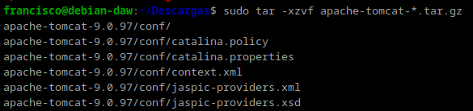

Movemos el contenido al directorio creado anteriormente `/opt/tomcat`
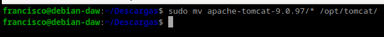

Añadimos al grupo tomcat `sudo groupadd tomcat`
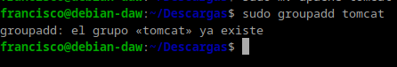

Ahora, agregamos el usuario tomcat `sudo useradd -g tomcat -d /opt/tomcat -s /usr/sbin/nologin tomcat`
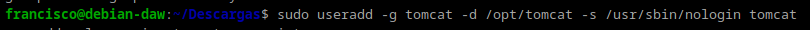

Damos al usuario y grupo permisos recursivos sobre /opt/tomcat ejecutando el comando `sudo chown -R tomcat:tomcat /opt/tomcat/`
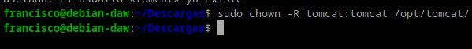

Obtenemos la ruta del paquete Java que instalamos en los primero pasos del tutorial `sudo update-java-alternatives -l`

Creamos el archivo `sudo nano /etc/systemd/system/tomcat.service` y escribimos lo siguiente, sustituyendo la variable `JAVA_HOME` por nustra ruta
~~~
[Unit]
Description=Apache Tomcat
Wants=network.target
After=network.target

[Service]
Type=forking

Environment=JAVA_HOME=/usr/lib/jvm/java-1.11.0-openjdk-amd64/

Environment=CATALINA_PID=/opt/tomcat/temp/tomcat.pid
Environment=CATALINA_HOME=/opt/tomcat

Environment='CATALINA_OPTS=-Xms512M -Xmx1G -Djava.net.preferIPv4Stack=true'
Environment='JAVA_OPTS=-Djava.awt.headless=true'

ExecStart=/opt/tomcat/bin/startup.sh
ExecStop=/opt/tomcat/bin/shutdown.sh
SuccessExitStatus=143

User=tomcat
Group=tomcat
UMask=0007
RestartSec=10
Restart=always

[Install]
WantedBy=multi-user.target
~~~
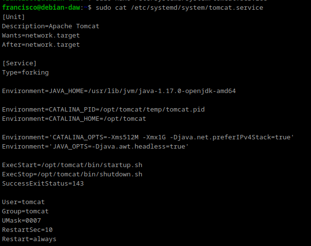

Damos permisos al script `chmod +x /opt/tomcat/bin/*.sh`

Arrancamos el servicio de Tomcat usando systemctl `sudo systemctl start tomcat.service` y comprobamos que esta corriendo `sudo systemctl status tomcat.service`
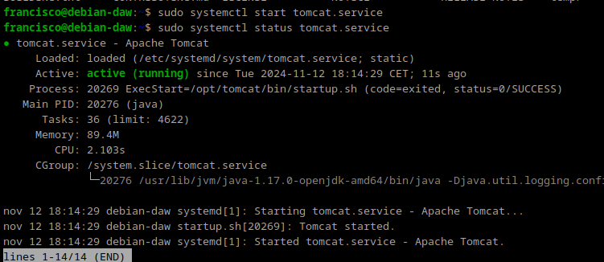

Habilitamos el servicio `sudo systemctl enable tomcat`
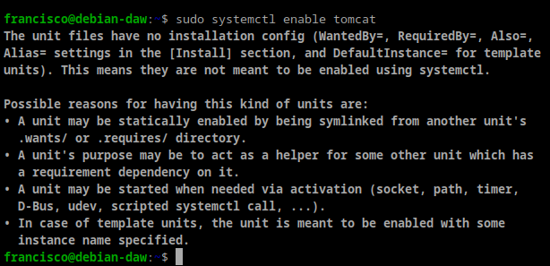

Ahora, añadimos un usaruio de tomcat en el archivo de configuracion `/opt/tomcat/conf/`. `sudo nano /etc/tomcat9/tomcat-users.xml`
~~~
<role rolename="admin"/>
<role rolename="admin-gui"/>
<role rolename="manager"/>
<role rolename="manager-gui"/>

<user username="linuxhint" password="YourPasswordHere" roles="admin,admin-gui,manager,manager-gui"/>
~~~
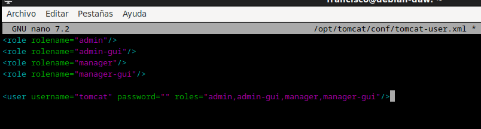

Ahora podemos acceder desde ``http://localhost:8080`
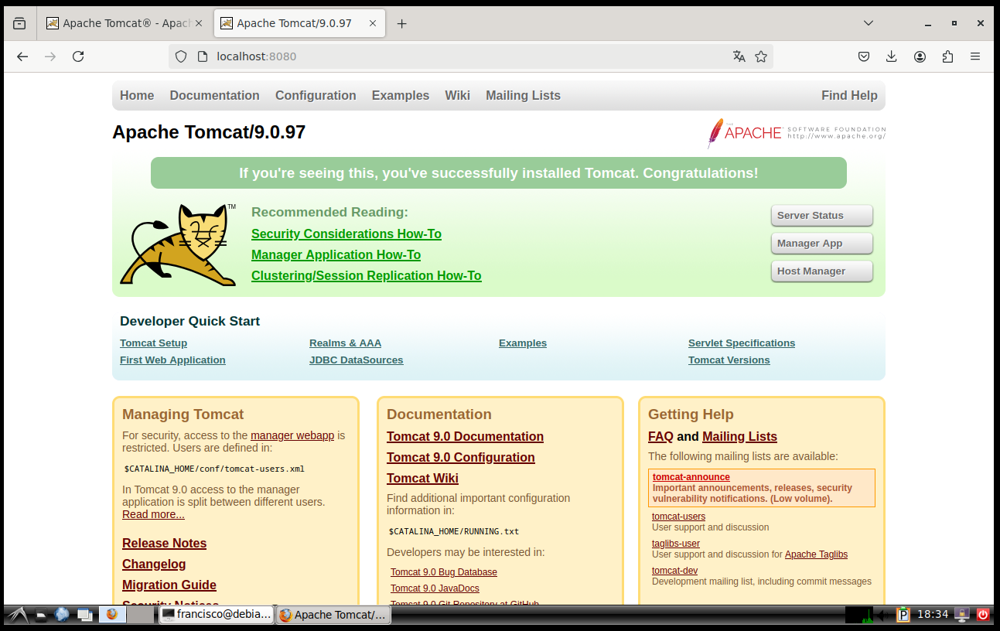


## Despliegue con Maven
Para instalar Maven en nuestro Debian tenemos, de nuevo, dos opciones:
1. Instalación mediante gestor de paquetes APT
2. Instalación manual

La primera, recomendada, es mucho más sencilla y automatizada (establece todos los paths y variables de entorno), aunque con la segunda se podría conseguir un paquete más actualizado.

Si decidimos seguir el primer método, el más sencillo, vemos que es tan simple como actualizar los repositorios:
```
sudo apt update
```

E instalar Maven:
```
sudo apt install maven
```

Para comprobar que todo ha ido correctamente, podemos ver la versión instalada de Maven:
```
mvn --version
```
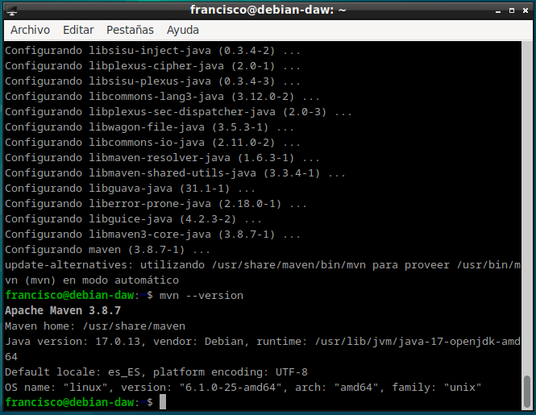

## Configuración de Maven
Para poder realizar despliegues en nuestro Tomcat previamente instalado, necesitamos realizar la configuración adecuada para Maven. Ya sabemos que esto en Linux significa editar los archivos de configuración adecuados. Vamos a ello.

En primer lugar necesitamos asegurarnos de que en el apartado anterior de la práctica hemos añadido todos los usuarios necesarios, así como sus respectivos roles. Debemos añadir el rol de manager-script para permitir que Maven se autentique contra Tomcat y pueda realizar el despliegue.

Los roles utilizados por Tomcat vienen detallados en su documentación, que merece ser consultada.

En dicha documentación se nos indica que, por temas de seguridad, es recomendable no otorgar los roles de `manager-script` o `manager-jmx` al mismo usuario que tenga el rol de `manager-gui`.

Así las cosas, modificamos el archivo `/etc/tomcat9/tomcat-users.xml` (o el `opt/tomcat/conf/tomcat-users.xml`si lo instalamos desde la pagina web sehun nos indica la guia de instalacion) acorde a nuestras necesidades (los nombres de usuario y contraseña deberán ser los que elijáis para vosotros):

```
<role rolename="manager-gui"/>
<role rolename="manager-script"/>
<user username="gui-user" password="gui-password" roles="manager-gui"/>
<user username="script-user" password="script-password" roles="manager-script"/>
```


Editar el archivo ``/etc/maven/settings.xml`` para indicarle a Maven, un identificador para el servidor sobre el que vamos a desplegar (no es más que un nombre, ponedle el nombre que consideréis), así como las credenciales. Todo esto se hará dentro del bloque ``servers`` del XML:

````
<servers>
    <server>
        <id>Tomcat.P.3.1</id>
        <username>script-user</username>
        <password>script-password</password>
    </server>
</servers>
````
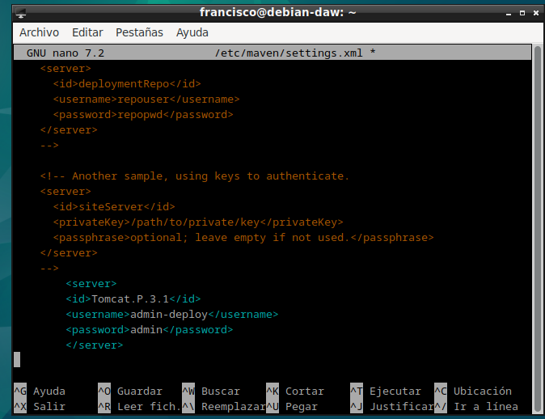

Ahora debemos modificar el POM del proyecto para que haga referencia a que el despliegue se realice con el plugin de Maven para Tomcat.

Otra opción sería utilizar el plugin Cargo.

Donde lo que añadimos es el bloque:
````
<build>
    <finalName>war-deploy</finalName>
    <plugins>
        <plugin>
            <groupId>org.apache.tomcat.maven</groupId>
            <artifactId>tomcat7-maven-plugin</artifactId>
            <version>2.2</version>
            <configuration>
                <url>http://localhost:8080/manager/text</url>
                <server>Tomcat.P.3.1</server>
                <path>/myapp</path>
            </configuration>
        </plugin>
    </plugins>
</build>
````

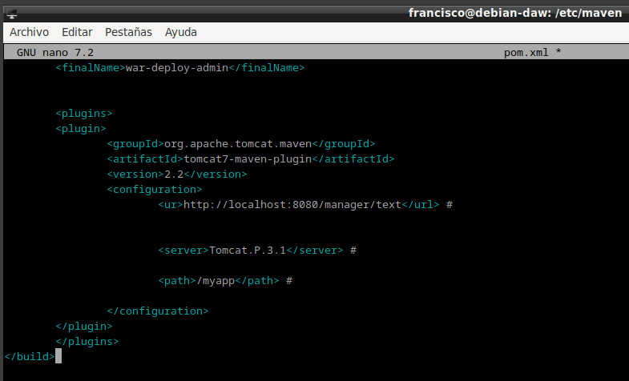

## Despliegue
Teniendo ya todo listo para realizar despliegues, ahora crearemos una aplicación Java de prueba para ver si podemos desplegarla sobre la arquitectura que hemos montado. Para ello utilizamos el comando:
````
mvn archetype:generate -DgroupId=raul -DartifactId=war-deploy -DarchetypeArtifactId=maven-archetype-webapp -DinteractiveMode=false
````

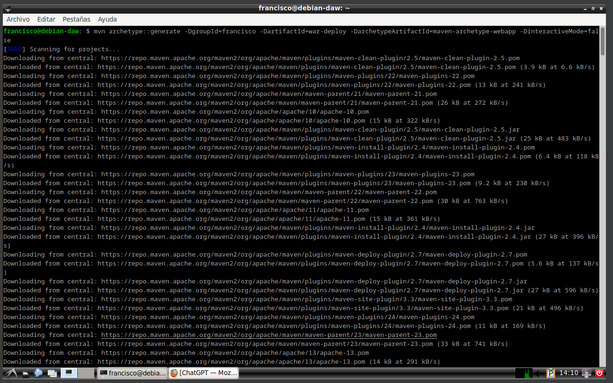

Podéis sustituir los valores de ``groupId`` y ``artifactId`` (este será el nombre de la aplicación) por lo que queráis.

Tras generar esta aplicación, los comandos finales que se utilizan en Maven para desplegar, volver a desplegar o desplegar una aplicación, son:

````
mvn tomcat7:deploy
mvn tomcat7:redeploy
mvn tomcat7:undeploy
````
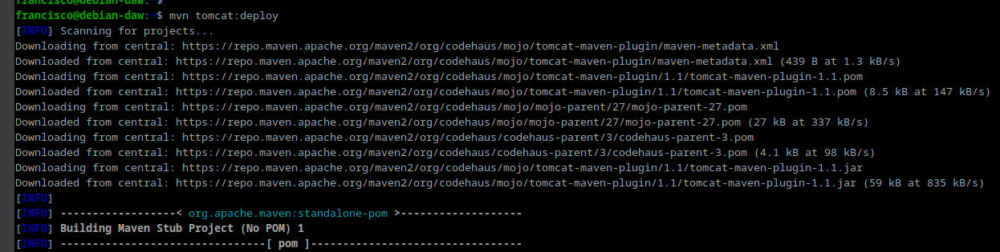

Y, accediendo a través de la GUI, debemos ver que la aplicación está desplegada y que podemos acceder a ella perfectamente.


