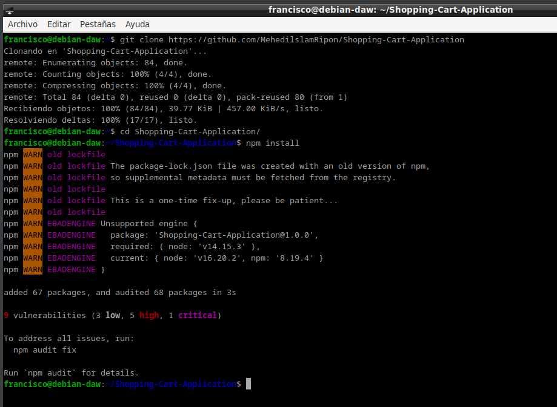

# Práctica 3.2: Despliegue de aplicaciones con Node Express
## Instalación de Node.js

Para utilizar Express.js, primero debemos instalar NodeJS . Para ello, tenemos varias formas, pero yo instalaré la última versión estable.

Para completar esto, abra una terminal y primero actualice el sistema operativo. `sudo apt update` y `sudo apt upgrade`.

Agregmos el 16.x repositorio de ramas de NodeJS.
````
curl -sL https://deb.nodesource.com/setup_16.x | sudo -E bash -
````

Ejecutamos el comando `sudo apt install nodejs`

## Instalación de ExpressJS
Ahora tenemos que instalar Express.js y para hacerlo globalmente tienes que ejecutar `sudo npm install -g express`.


Luego creamos la carpeta del proyecto: `mkdir project`
Accedemos a la carpeta `cd project`
Luego inicializamos el proyecto `npm init -y`

Instalamos Express.js para este protecto localmente `npm install express`

Ahora crea un archivo de muestra `sudo nano app.js`
y añadimos lo siguiente: 
````
const express = require('express')
const app = express()
const port = 3000

app.get('/', (req, res) => {
    res.send('Hello. Welcome to this blog')
})

app.listen(port, () => {
    console.log(`Example app listening at http://localhost:${port}`)
})
````


Ahora ejecutmos el proyecto con `node app.js`


Ahora abrimos el navegador con la url `http://localhost:3000`


## Despliegue de una nueva aplicación

Vamos ahora a realizar el despliegue de una aplicación de terceros para ver cómo es el proceso.

Se trata de un "prototipo" de una aplicación de predicción meteorológica que podéis encontrar en este repositorio de Github.

Tal y como indican las instrucciones del propio repositorio, los pasos a seguir son, en primer lugar, clonar el repositorio a nuesta máquina:
````
git clone https://github.com/MehedilslamRipon/Shopping-Cart-Application
````
Nos movemos al nuevo directorio `cd Shopping-Cart-Application/`
Instalamos las librerías necesarias `npm install`


Por último, iniciamos la aplicación `npm run start`
Y no dará seguramente el siguiente error:

Instalamo nodemon `npm install nodemon --save-dev` y ya se soluciona el error.


Ya podemos iniciar sin problema la página en el navegador

