# Práctica 3.4: Despliegue de una aplicación React en Netlify (PaaS)
Nos logeamos por SSH en nuestro Debian, desde el PC anfitrión. Nos creamos un directorio para albergar la aplicación con el nombre que queramos `mkdir mi-aplicacion-netlify`. 
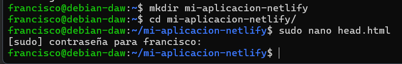

En este directorio, creamos los 3 archivos que conformará nuestra sencilla aplicación de ejemplo:
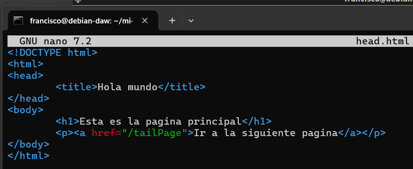
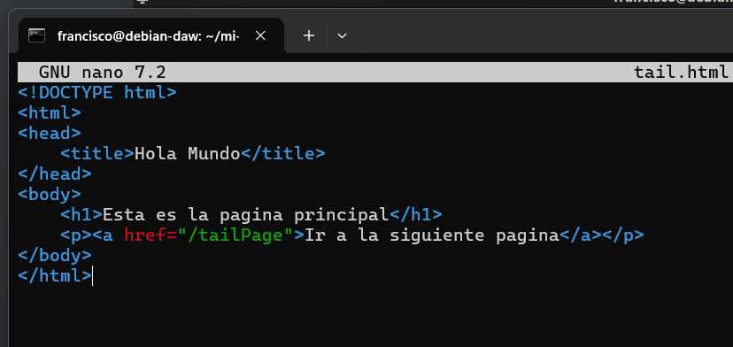

Ahora, tal y como hacemos siempre a la hora de crear nuestra aplicación Node.js, con el fin de crear el archivo package.json, utilizaremos en el terminal el comando:
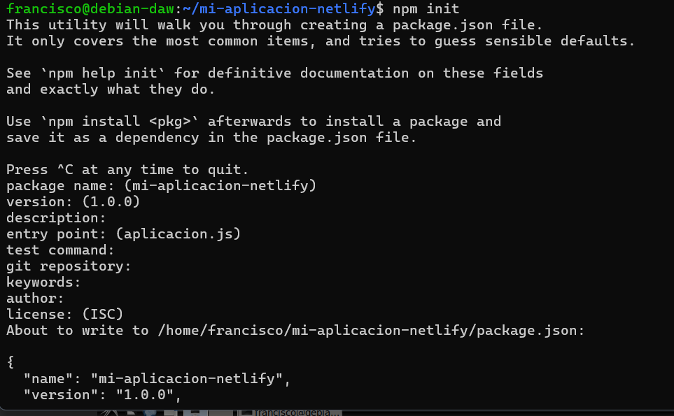

Ahora desde el navegador de la máquina anfitriona podemos acceder a `http://IP-maq-virtual:8080`.
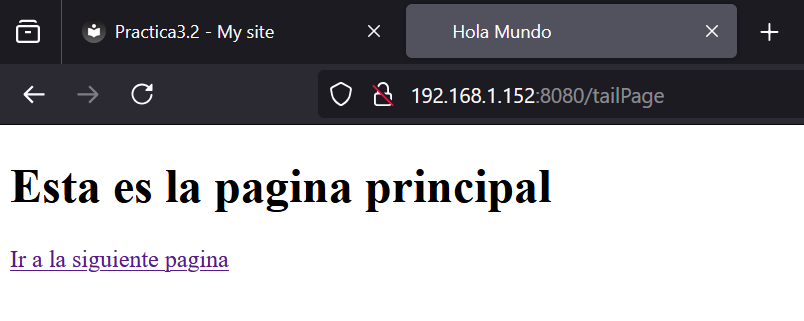

## Aplicación para Netlify
Puesto que el interés en este módulo radica en el proceso de despliegue, suponiendo que la parte de desarrollo ya es abordada en otros módulos, vamos a utilizar una aplicación de ejemplo que nos ahorre tiempo para centrarnos en el despliegue.

Nos clonaremos este repositorio:
````
git clone https://github.com/StackAbuse/color-shades-generator
````
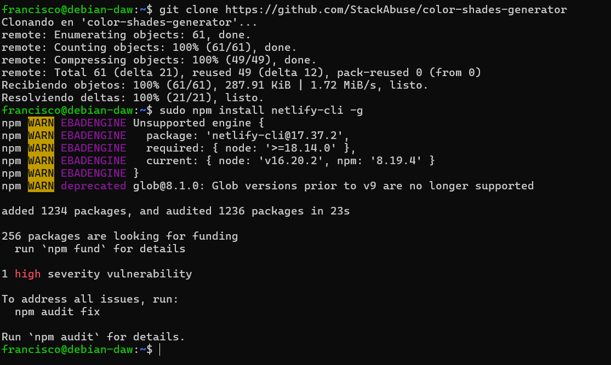

## Prceso de despliegue en Netlify mediante CLI
Una vez registrados, debemos instalar el CLI de Netlify para ejecutar sus comandos desde el terminal:`sudo npm install netlify-cli -g`

Nos logeamos `nerlify login`
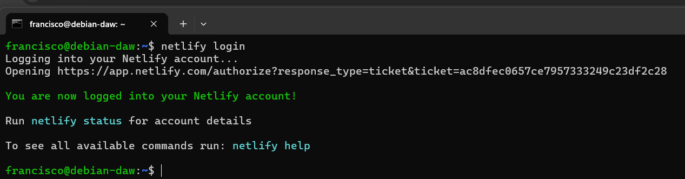

Nos muestra en el navegador, generamos el tokende acceso
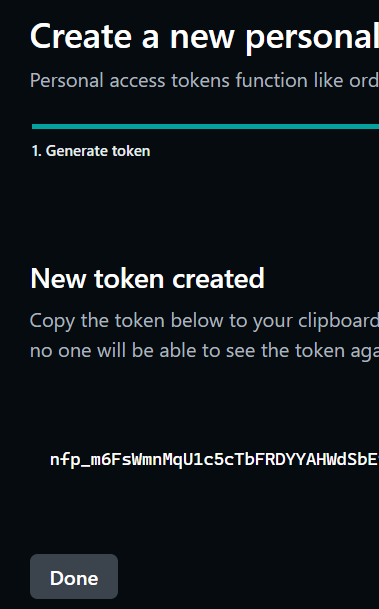

Bueno, tenemos el código de nuestra aplicación, tenemos nuestra cuenta en Netlify y tenemos el CLI necesario para ejecutar comandos desde el terminal en esa cuenta... ¿Podemos proceder al despliegue sin mayores complicaciones?

La respuesta es NO, como buenos desarrolladores y en base a experiencias anteriores, ya sabéis que hay que hacer un build de la aplicación para, posteriormente, desplegarla. Vamos a ello.

En primer lugar, como sabemos, debemos instalar todas las dependencias que vienen indicadas en el archivo ``package.json``: `npm install`

Y cuando ya las tengamos instaladas podemos proceder a realizar el build:`npm run build`

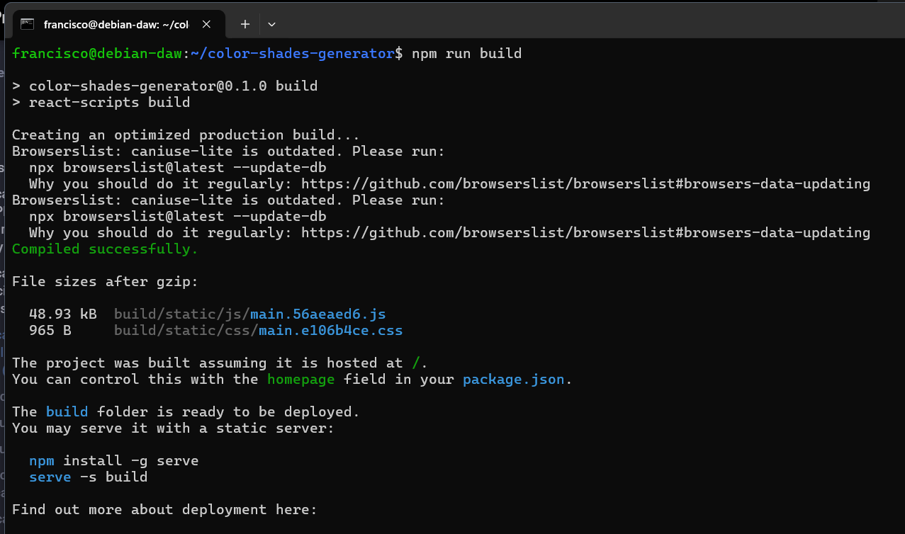

Esto nos creará una nueva carpeta llamada build que contendrá la aplicación que debemos desplegar. Y ya podemos hacer un pre-deploy de la aplicación de la que hemos hecho build antes:
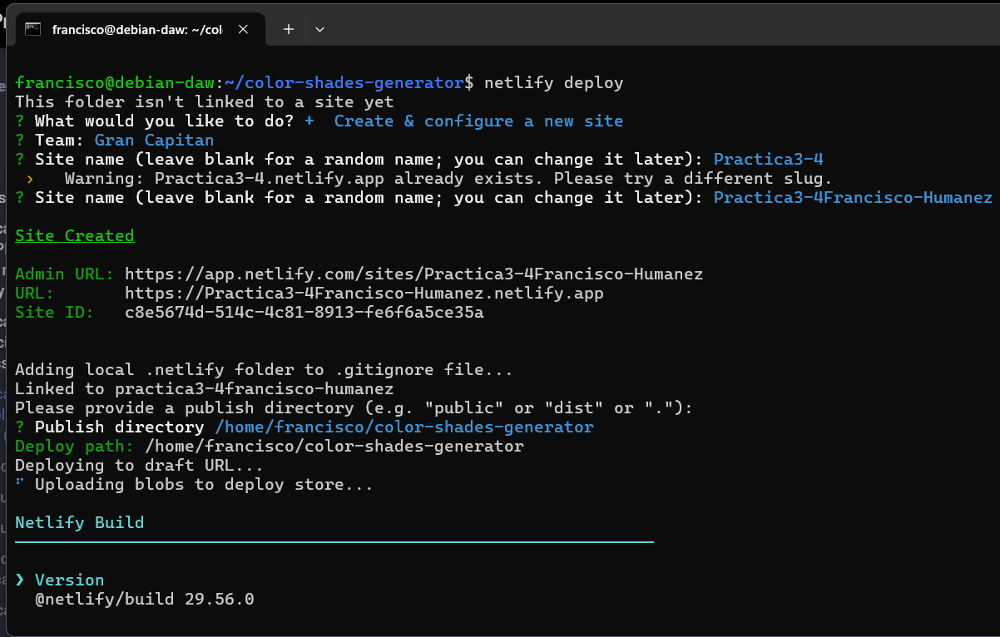

Nos hará algunas preguntas para el desplieuge:
Indicamos que queremos crear y configurar un nuevo site
El Team lo dejamos por defecto
Le indicamos el nombre que queremos emplear para la web (nombre-practica3-4) y el directorio a utilizar para el deploy (directorio ./build).
Y si nos indica que todo ha ido bien e incluso podemos ver el "borrador" (Website Draft URL) de la web que nos aporta, podemos pasarla a producción finalmente tal y como nos indica la misma salida del comando:
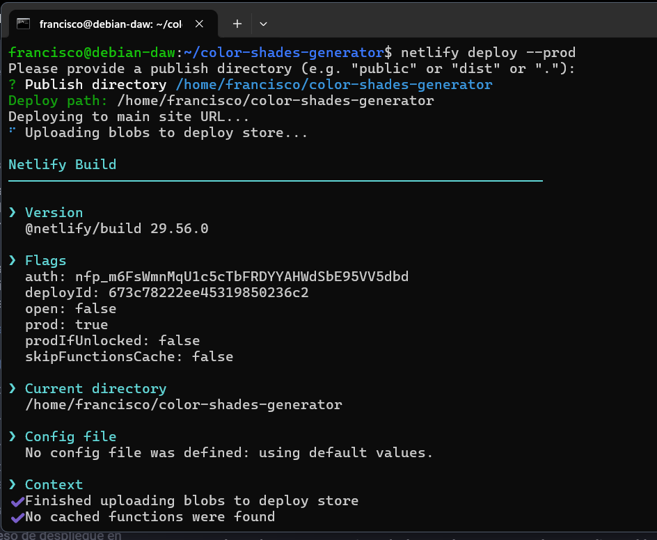

En primer lugar, vamos a eliminar el site que hemos desplegado antes en Netlify para evitarnos cualquier problema y/o conflicto:
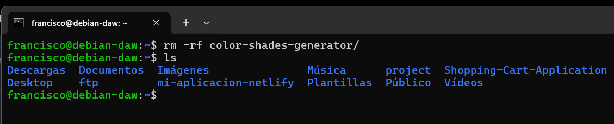
Creamos una carpeta nueva y descomprimimos dentro el zip:
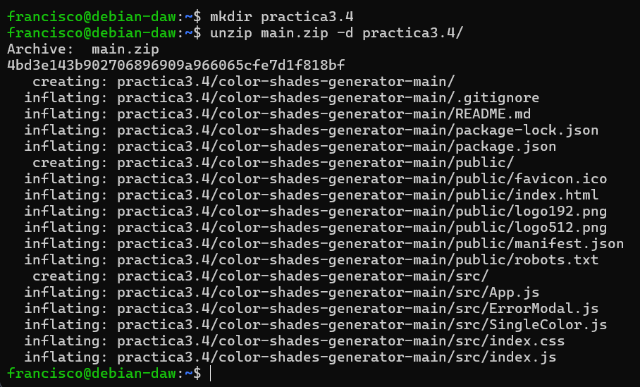

Ahora debemos crear un repositorio completamente vacío en Github que se llame practicaTresCuatro:
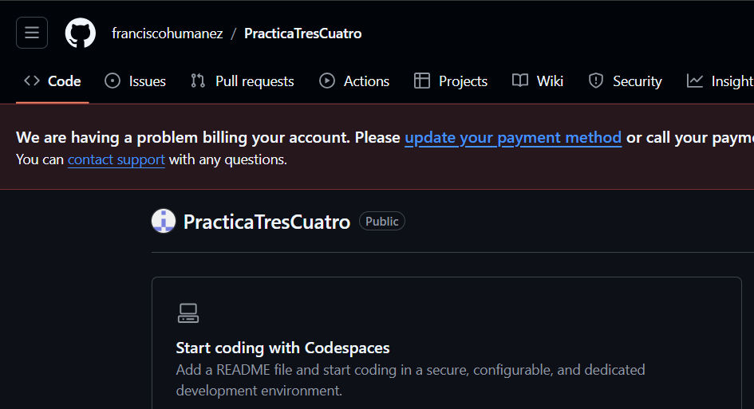

Y tras ello, volviendo al terminal a la carpeta donde estábamos, la iniciamos como repositorio, añadimos todo el contenido de la misma para el commit, hacemos el commit con el mensaje correspondiente y creamos la rama main:
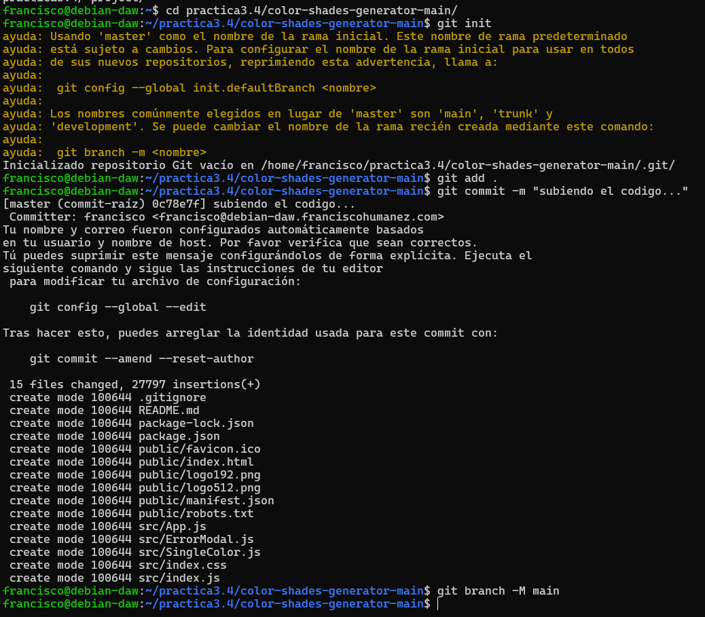

Y ahora sólo queda referenciar nuestra carpeta al repositorio recién creado en Github y hacer un push para subir todo el contenido del commit a él:

Ahora que ya tenemos subido el código a GitHub, de alguna manera debemos enganchar o enlazar nuestra cuenta de Github con la de Netlify para que éste último pueda traerse el código de allí, hacer el build y desplegarlo. Así pues, entramos en nuestro dashboard de Netlify y le damos a importar proyecto existente de git
Le indicamos que concretamente de Github:
Y nos saltará una ventana pidiendo que autoricemos a Netlify a acceder a nuestros repositorios de Github:
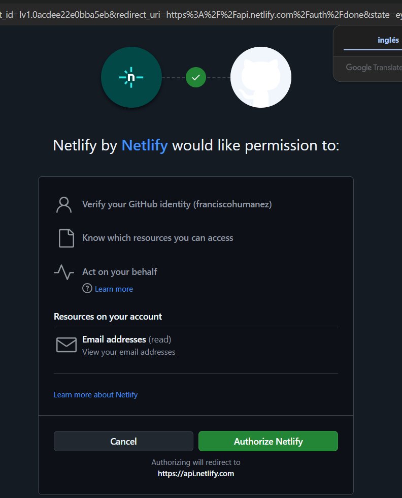

Y desplegamos la aplicación:
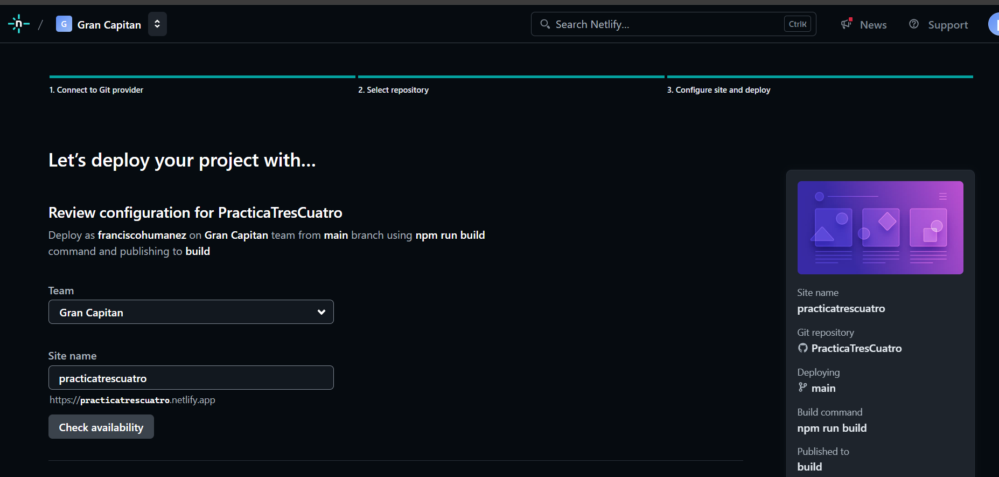

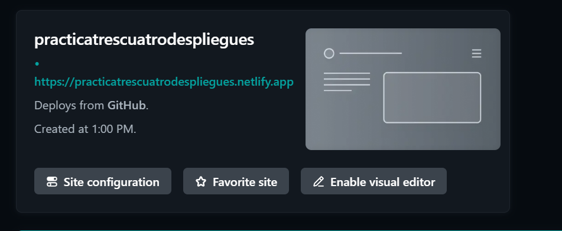
Dentro de la carpeta public encontramos el archivo robots.txt, cuyo cometido es indicar a los rastreadores de los buscadores a qué URLs del sitio pueden acceder. A este archivo se puede acceder a través de la URL del site:
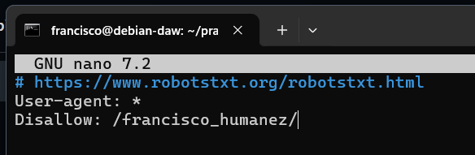
Haz un nuevo commit y push (del caso anterior, recuerda el commando git previo para añadir los archivos a hacer commit)

Comprueba en el dashboard de Netlify que se ha producido un nuevo deploy de la aplicación hace escasos segundos
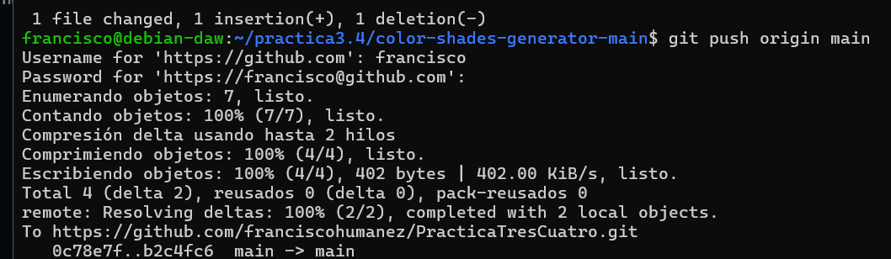
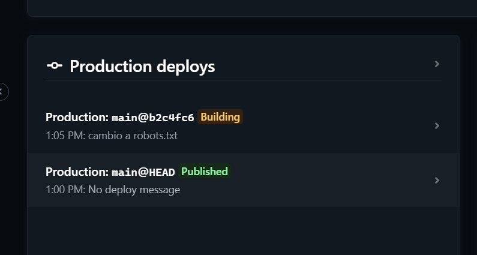

Accede a ``https://url_de_la_aplicacion/robots.txt`` y comprueba que, efectivamente, se ve reflejado el cambio
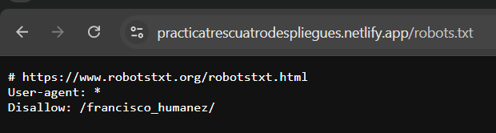
