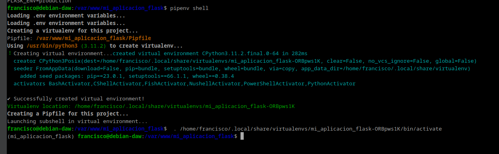

# Práctica 3.5 - Despliegue de una aplicación Flask
## Procedimiento
Instalamos el gestor de pauetes de Python `pip`:
````
sudo apt update

sudo apt install python3-pip

````


Instalamos `pipenv`
````
sudo apt install pipenv
````


Después de haberlo instalado comprobamos que está instalado correctamente con `pipenv --version`


Seguido de esto creamos un directorio en el que almacenaremos nuestro proyecto `sudo mkdir /var/www/nombre_mi_aplicacion
`


Si hemos creado el directrio con sudo, tenemos que cambiarle los permisos para que el dueño sea nuestro usuario (ud24) y pertenezca al grupo `www-data`
````
sudo chown -R $USER:www-data /var/www/mi_aplicacion

chmod -R 775 /var/www/mi_aplicacion   
````


Ahora, tenemos que crear un archivo oculto `.env` dentro de nuestra aplicación


Hay que modificar el arvhivo y añadir las variables, indicando cual es el arvhivo `.py` de la aplicación.


Iniciamos el entorno virtual `pipenv shell`


Instalamos las dependencias de nuestro proyecto `pipenv install flask gunicorn`


Vamos a crear la aplicación Flask más simple posible `touch application.py wsgi.py`


Añadimos la siguiente configuración a los archivos:
application.py:
````
from flask import Flask

app = Flask(__name__)

@app.route('/')
def index():
    '''Index page route'''

    return '<h1>Aplicacion desplegada</h1>'
````

wsgi.py
````
from application import app

if __name__ == '__main__':
    app.run(debug=False)
````


Lanzamos la aplicación con el comando `flask run --host '0.0.0.0'`


Podemos acceder desde nuestra máquina anfitriona accediento a la Ip de la máquina virtual y el puerto `5000`


Si ha funcionado lo anterior, vamos a comprobar que funciona correctamente usando Gunicorn. `gunicorn --workers 4 --bind 0.0.0.0:5000 wsgi:app`


Todavía dentro de nuestro entorno virtual, debemos tomar nota de cual es el path o ruta desde la que se ejecuta gunicorn para poder configurar más adelante un servicio del sistema. Podemos averigurarlo así:


Iniciamos Nginx y comprobamos que se ha activado
````
sudo systemctl start nginx

sudo systemctl status nginx
````


Ahora, fuera de nuestro entrono virtual, tnenmos que crear un archivo para que systemd corra Gunicorn como un servicio `sudo nano /etc/systemd/system/flask_app.service`


Habiltamos el servicio y se inicia
````
systemctl enable nombre_mi_servicio

systemctl start nombre_mi_servicio
````


Creamos un archivo con el nombre de nuestra aplicación y dentro estableceremos la configuración para ese sitio web. El archivo, como recordáis, debe estar en /etc/nginx/sites-available/nombre_aplicacion y tras ello lo editamos para que quede:
